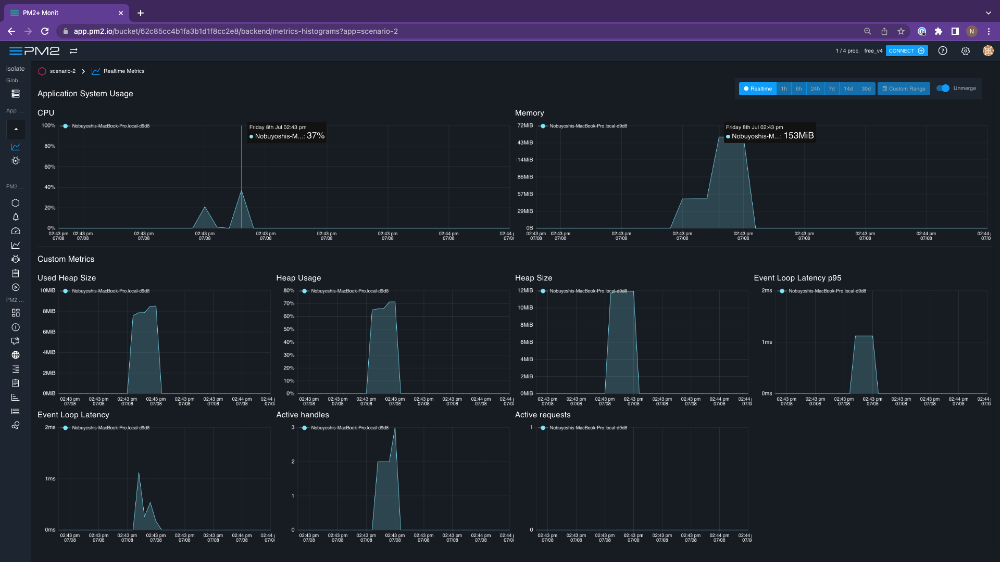

# `isolated-vm` testing
This repository contains scripts and additional notes related to the test scenarios described below.

## Test Scenarios
### Scenario 1
- Create 100 isolates using `isolated-vm` in a Node.js worker pool. Use 128MB for each isolate.
- Measure total memory consumed by Node.js after all isolates are instatiated.

### Scenario 2
- Create 100 isolates using `isolated-vm` in a Node.js worker pool. Use 128MB for each isolate.
- In each isolate `compileScriptSync` a JS script. Use the following [function](https://developers.cloudflare.com/workers/examples/geolocation-app-weather/).
- Measure the maximum memory consumed by Node.js after all isolates compile the scripts.

### Scenario 3
- Create 100 isolates using `isolated-vm` in a Node.js worker pool. Use 128MB for each isolate.
- In each isolate `compileScriptSync` a JS script. Use the following [function](https://developers.cloudflare.com/workers/examples/geolocation-app-weather/).
- In each isolate, run the compiled script. 
- Automatically terminate an isolate if execution takes more than 50ms. 
- Measure maximum memory consumed by Node.js in the entire operation.

## How to install and use `pm2` monitor

- Signup for https://app.pm2.io
- Create new bucket for testing 
- On top right, click on "connect" button 
- Follow the steps mentioned under the "connect" tab up to step 2
- Once you link to the `pm2` (step 2), run the following command in your terminal:  
  ```
  pm2 start scenario-3
  ```
  Instead of `scenario-3` you can use any other scenario
- Now you can see the live monitoring for your script in `pm2` dashboard!
​
## Test Results 

### Scenario 1
Total memory used: 
​
### Scenario 2  
Total memory used: **164 MB**
<br/>  

​
### Scenario 3  
Total memory used: **221 MB**  
</br>
